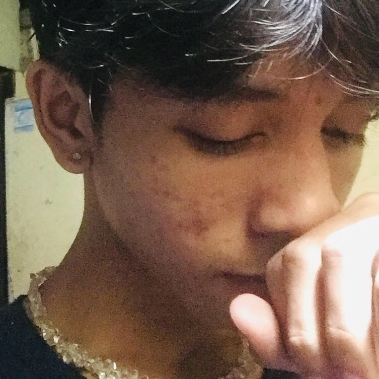

# Object - Oriented Programming🎉
### Hello, Welcome to repository of my Object - Oriented Programming that contains about me and my midterm labaratory task & activity.

--- 
# About Me🙈

  

### I'm Dexter, or you can also call me as "Dekdek", 20 years old and I live in Brgy. Balibago,  Angeles City.  I love cooking, exploring, playing online games, listening to music, watching and reading, I'm also excited to learn new things to achieve my goals and become a better programmer soon.

   

---
### 🌱 What I Believe In:
- **GOD** love's you, **GOD** is in control🙏
- Treating others with **kindness and respect** creates meaningful connections.🤝  
- **Growth comes through effort**, persistence, and learning from challenges.🚀  
- Gratitude for the small things makes life richer.✨  

I’m always eager to **learn, support**, and become a better version of myself every day.

---
## 😄Fun Facts About Me:
- 🖊️ I take notes, but sometimes I forget where I put them.   
- 😊 I smile a lot because it makes me feel better.
- 📱 I check my phone too much, even when I don’t need to.
- 🎒 I carry way too many things in my backpack.
- 📚 I borrow books from the library and then I forget to return them.
- 🥳 I celebrate finishing small tasks like I won in life. 

---
## 📌 Skills
- Problem Solving🧠  
- Empathy🤗
- Good Listener 👂‍♂️   
- Critical - Thinking🔎
- Teamwork🤜🤛 
- Stewardship💫

---
## 👨‍🎓Education
**Senior High School:** Rafael L. Lazatin Memorial High School-Senior High School(HUMSS Strand) ✅  

**Junior High School:** Rafael L. Lazatin Memorial High School

**Elementary:** Gueco Balibago Elementary School

---

## 📚Languages I used before 

---
## 📝 MIDTERM

- 🧪 **Paired Lab Task:** 
- 🧪 **Midterm Lab Task 1:** [View File](https://drive.google.com/file/d/1XftQKxotqrKBoReYY3T-T9W1uEZFHDUe/view?usp=sharing)
- 🧪 **Midterm Lab Task 2:** [View File](MidTermLabTask2.pdf)
- 🧪 **Midterm Lab Task 3:** [View File](./MLabTask3.pdf)  
- 🧪 **Midterm Lab Task 4:** [View File](MtermLabTask4.pdf)
- 🧪 **Midterm Lab Task 5:** [View File](MtermTaskLab5.pdf)

## 📑FINAL
- 🧪 **Final Lab Task 1:** [View File](FinalLabTask1.pdf)
- - 🧪 **Final Lab Task 5:** [View File](FinalLabTask5.pdf)

